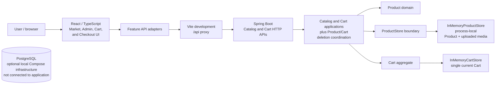
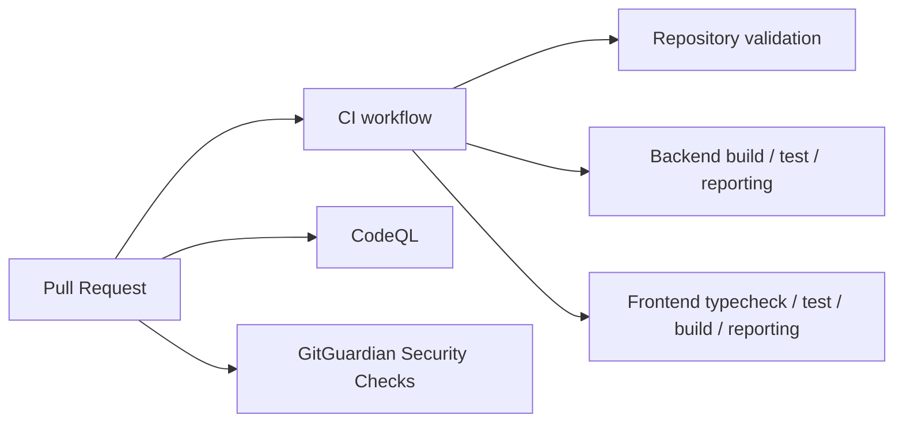

# Samska Sandbox

[](LICENSE)

Samska Sandbox is a public engineering sandbox for practicing software
architecture, quality, security, delivery, and operational engineering through
a fictional commerce domain. It is non-commercial, and the source code is
licensed under the [Apache License 2.0](LICENSE).

## Current Milestone

- **Target milestone:** `v0.1.0 — First Order` (unreleased)
- **Current stage:** Product Media Upload implemented
- **Next planned work:** Payment Simulator

[View the live Samska Sandbox Project](https://github.com/users/Samska/projects/1)

The product release is still future. No Git tag or GitHub Release exists yet.
The backend's `0.1.0-SNAPSHOT` and the private frontend package's `0.1.0`
are build metadata, not evidence of a published product release.

## Purpose And Scope

Samska Sandbox uses a fictional catalog and order journey to demonstrate
evidence-driven engineering. The current application contains a Java/Spring
Boot backend, a React/TypeScript frontend, a Catalog boundary for Products with
bounded local media upload, a process-local Cart boundary, an editable Checkout
view over the current Cart, and a separate Admin Product-management surface.

AI agents are implementation tools operating under repository-defined
governance. Humans own requirements, architecture, decisions, review,
validation, learning, and risk.

## Current Capabilities

| Capability | Status | Current boundary |
| --- | --- | --- |
| Product domain model | Implemented | Framework-independent Catalog rules and identity. |
| Catalog API | Implemented | Product creation, collection browsing, retrieval by identity, full update, and deletion with a `409` Cart conflict refusal. |
| Market UI | Implemented | Product-oriented browsing, detail view, Cart selection, and the customer storefront shell at `/`. |
| Product Discovery | Implemented | Product descriptions with a selectable detail view, local product media with a monogram fallback, Add to Cart, and a return to browsing. |
| Shopping Cart | Implemented | Process-local Cart contents, quantity changes, removal, and server-calculated totals. |
| Product UX Foundation | Implemented | Commerce-oriented shell, responsive Product browsing, integrated Cart presentation, and accessible feedback. |
| Product Storefront UX/UI | Implemented | Browse, detail, and feedback presentation refined with a small shared primitive layer and focus return; optional nullable Product `mediaKey` resolved to curated local assets with a monogram fallback; accessible Cart drawer with the quantity-summed item count; the Cart API contract is unchanged. |
| Checkout | Implemented | An editable live view of the current authoritative Cart: quantity changes and item removal happen directly in Checkout using the existing Cart operations, server responses update the view, and no backend Checkout resource, identity, or snapshot exists yet. |
| Admin Catalog Management | Implemented | Compact management list at `/admin/products` with case-insensitive name search, thumbnails, Edit links, and delete confirmation; dedicated `/admin/products/new` and `/admin/products/{id}/edit` forms with staged image selection; Admin paths are navigation only, not access control. |
| Product Media Upload | Implemented | One validated, re-encoded JPEG per Product stored with the Product in bounded backend process memory; uploaded media takes display precedence in Market cards and detail, with curated media and the monogram fallback retained; limits are enforced server-side and rejection changes nothing. |
| Backend and frontend automated tests | Implemented | Unit, component, type-check, and build verification. |
| Structured CI test reporting | Implemented | Named backend/frontend Check Runs, summaries, annotations, and XML artifacts. |
| PostgreSQL | Infrastructure only | Optional local Compose runtime; not connected to the application. |
| Payment, orders, E2E, deployment | Planned | The remaining capabilities after Product Media Upload in the owner-approved sequence; end-to-end automation and deployment follow the local MVP. |

## Architecture



The Vite proxy is for local development only. Product and Cart data, including
uploaded Product media, are held in process memory and are lost when the backend
restarts. Uploaded media is validated, dimension-checked, and re-encoded as JPEG
before storage, is limited to one image per Product, and is served only for the
Product's current media ID; rejection leaves the Product and its current image
unchanged. Checkout is a frontend
review of the current Cart and holds no server-side state at this stage. The
Admin surface is a separate frontend route over the same Catalog API, and
`/admin/products` provides no access control. Product deletion is refused with
`409` while the Product is in the current Cart through a process-local
coordination lock that covers the HTTP add-to-Cart and delete-Product paths.
PostgreSQL is deliberately shown separately because the application has no
database connection or persistence.

## Engineering Practices

- Modular-monolith backend direction with explicit business boundaries.
- Short-lived branches, focused pull requests, and squash-only merges.
- Risk-based backend, frontend, repository, and security verification.
- Independent CI jobs with structured test-result publication.
- Immutable GitHub Action pins and least-privilege workflow permissions.
- CodeQL and GitGuardian checks remain separate from application CI.
- ADRs record significant, durable architecture decisions.
- Agent, human, and CI verification evidence remain distinct.

## CI And Security



The `CI` workflow contains three independent jobs. CodeQL is GitHub-managed
and currently analyzes GitHub Actions, Java/Kotlin, and JavaScript/TypeScript.
GitGuardian remains a separate secret-related check. Secret scanning and push
protection are repository controls documented in [GitHub controls](docs/GITHUB.md).

## Technology Overview

| Area | Current technology |
| --- | --- |
| Backend | Java 25, Spring Boot 4.1.1, Maven Wrapper |
| Frontend | React 19, TypeScript, Vite, Tailwind CSS v4 |
| Testing | JUnit/Surefire, Spring MockMvc, Vitest, React Testing Library |
| Local infrastructure | PostgreSQL 18 via Docker Compose, not application-integrated |
| CI/CD | GitHub Actions, structured JUnit reporting, immutable Action pins |
| Security | CodeQL, GitGuardian, GitHub secret protection controls |
| AI-assisted engineering | Repository-governed coding agents with human ownership |

Future technologies such as Redis, RabbitMQ, Playwright, Testcontainers,
OpenTelemetry, Terraform, and deployment platforms are not current stack
components.

## Roadmap And Next Work

The Product Storefront UX/UI refinement (SS-031) is complete and merged through
PR #52. Checkout (SS-032) is implemented as an editable live view of the current
Cart; the immutable transactional snapshot is deferred to Payment Simulator
work. Admin Catalog Management (SS-033) is complete and merged through PR #56.
Product Media Upload (SS-034) adds bounded, validated, in-memory JPEG upload per
Product with uploaded-media display precedence and a retained curated/monogram
fallback. The owner-approved sequence continues
with Payment Simulator, order creation, the complete First
Order journey, and then the `v0.1.0` release. Authentication and authorization
remain deferred until after the local MVP but are mandatory before any hosted
environment; `/admin/products` is navigation and not an access-control boundary.
Future capabilities receive an SS identifier only when their GitHub Issue is
created; the roadmap does not reserve future identifiers.

See the [roadmap](docs/ROADMAP.md) for product direction and the [live Project](https://github.com/users/Samska/projects/1)
for execution state.

## Local Development

Install the repository's Java 25 and Node 24.20.0 prerequisites, then install
frontend dependencies and start the current Catalog application:

```bash
cd web
npm ci --ignore-scripts
cd ..
./scripts/dev.sh
```

The launcher starts Spring Boot and Vite. PostgreSQL is optional and is not
required for the current application. See [Local Development](docs/LOCAL-DEVELOPMENT.md)
for setup, verification, troubleshooting, and shutdown.

## Documentation

- [Product direction](docs/PRODUCT.md)
- [Architecture](docs/ARCHITECTURE.md)
- [Testing strategy](docs/TESTING.md)
- [Security engineering](docs/SECURITY.md)
- [GitHub controls](docs/GITHUB.md)
- [AI engineering governance](docs/AI-GOVERNANCE.md)
- [Engineering Learning Journal](docs/learning/README.md)
- [Architecture Decision Records](docs/adr/README.md)
- [Contributing](CONTRIBUTING.md)
- [Security reporting](SECURITY.md)
